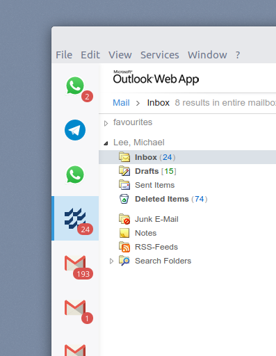

# Fachhochschule Kiel Franz Integration
This is the [Franz](https://meetfranz.com/) integration of the Fachhochschule Kiel mail service.

### Installation

1. Make sure the following folder exists:

    - Mac: `~/Library/Application Support/Franz/recipes/dev/`
    - Windows: `%appdata%/Franz/recipes/dev/`
    - Linux: `~/.config/Franz/recipes/dev`

2. If the `dev` subfolder does not exist create it.

3. Copy the contents of this repo into that folder.

4. Restart Franz.

5. Now you should find the service unter *development* when you add a new service.

### Further Reading

for more information on Franz integrations see:
https://github.com/meetfranz/plugins
